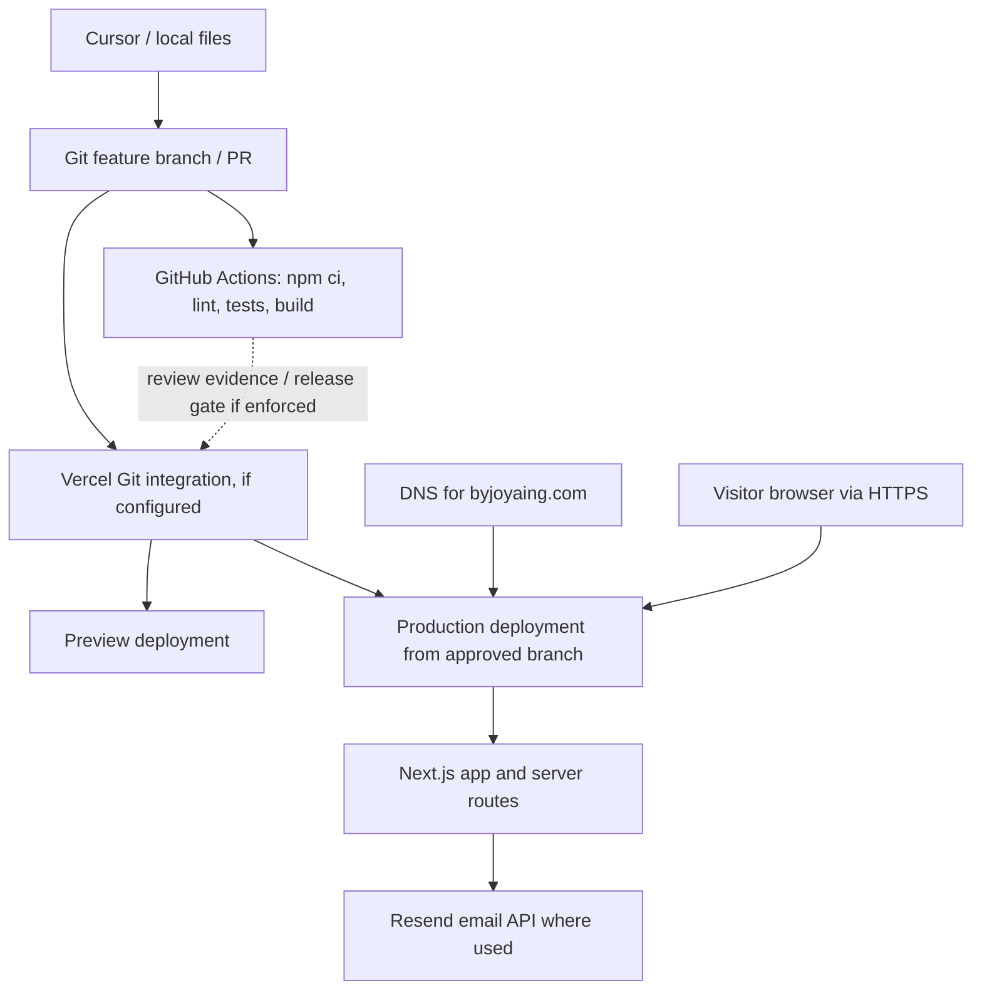

# Deployment Architecture — Portfolio

**Status:** proposed topology, backed by repository configuration where noted. Updated October 10, 2026. This is not a verified live infrastructure diagram.

## Conceptual system flow

## Evidence vs assumptions

| Layer | Finding | Evidence / verification |
|---|---|---|
| Source | `heyfunwhoa/byjoyaing-portfolio` Next.js 16 + React 19 + TypeScript | `package.json`, `README.md` on `main` |
| Code quality | `.github/workflows/ci.yml` triggers on PR/main, runs `npm ci`, lint, tests and build | Actual workflow file; passing runs need checking for the specific release |
| Email | Resend runtime dependency present | `package.json`. Actual sending route/config/permission not audited here |
| Hosting project | Vercel project named `byjoyaing-portfolio` exists in the connected account | Authenticated project listing, Oct 10, 2026 |
| Git-to-Vercel link, branch settings, deployment state, preview URL, production domain | **Unverified** | Vercel deployment history query was blocked by a 403 authorization error. Inspect project settings/deployments in the authorized Vercel scope |
| CI release gating | **Unverified** | A passing GitHub Actions job does not establish branch protection or Vercel Deployment Checks |
| DNS/TLS and website uptime | **Not tested** | Inspect domain records, certificate state and live responses before marking verified |

## Security boundaries
- Developer computer to GitHub: SSH/token access, branch review and protected commits.
- GitHub to Actions: use least-privilege workflow tokens, no unnecessary repository secrets for routine PR checks.
- Actions to Vercel: these are currently **separate systems**; do not assume CI checks block Vercel production automatically.
- Browser to application: public values only in client bundles; server-only keys stay on the server.
- Next.js server to Resend: API credentials are sensitive; never expose them in logs, previews, screenshots or client code.

## Questions to verify
1. Is Vercel actually connected to this GitHub repository and which branch is production?
2. Does a pull request receive a Vercel preview URL? Is preview access protected where necessary?
3. Are required GitHub checks and/or Vercel Deployment Checks enforced?
4. Which environment variable **names** exist in Development, Preview and Production? Never copy values.
5. What are the domain/DNS and rollback owners?
6. Is a known-good production deployment available for rollback without reversing unrelated changes?

Sources: [GitHub Actions](https://docs.github.com/en/actions), [Vercel deployment docs](https://vercel.com/docs/deployments), [Next.js deployment docs](https://nextjs.org/docs/app/getting-started/deploying).
